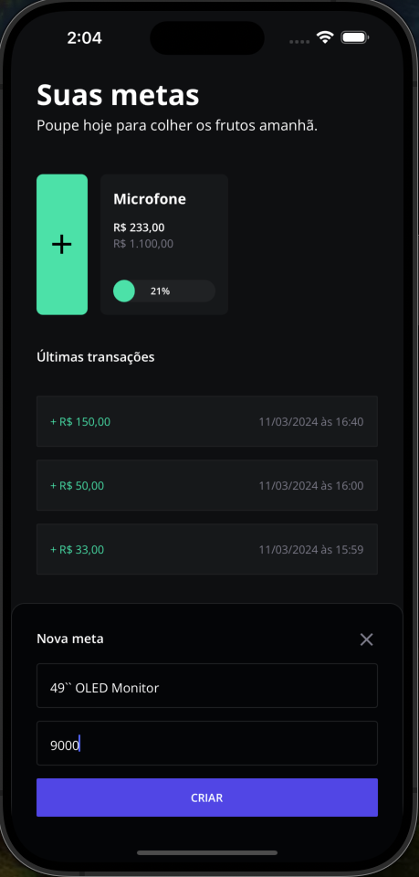
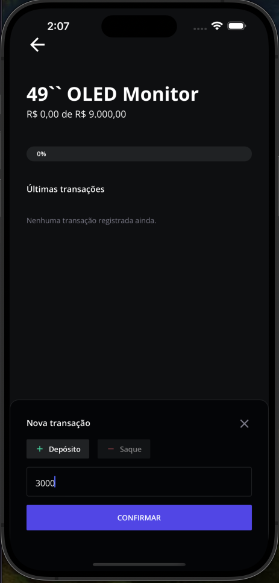
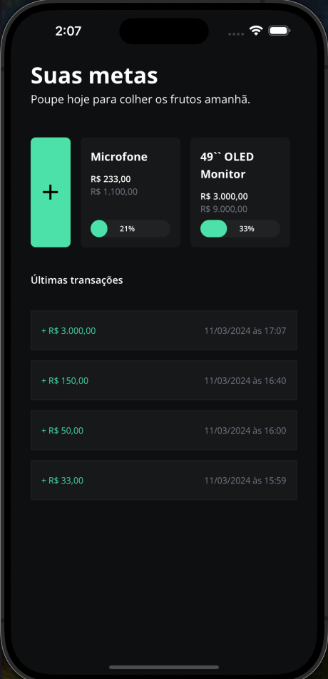

# React Native Practice #1 (App #2) - MyGoals app

<h1 align="center">
  
</h1>

## Project description:
Second project made on React Native Practice #1 promoted by RocketSeat.
starting point: https://github.com/orodrigogo/react-native-na-pratica-2

## Main libs used:
* expo sqlite (next)
* expo router
* nativewind

## User Instructions:

### 1) Enter a new Goal

### 2) Enter a new transaction

### 1) Follow your savings according to your goals

